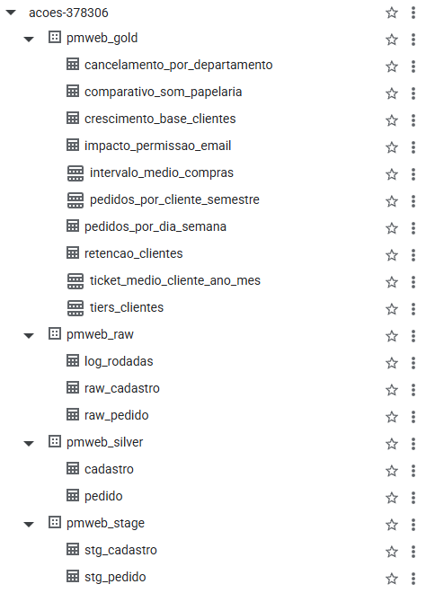
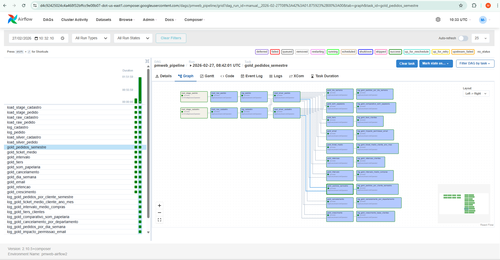

# 📦 PMWEB — Pipeline de Dados | Avaliação Técnica Data Services

> Pipeline de integração e análise de dados construído sobre **Google Cloud Platform**,
> utilizando arquitetura **Medallion** (Stage → Raw → Silver → Gold), orquestrado com
> **Apache Airflow** via **Cloud Composer** e com análises conectáveis ao **Looker Studio**.

---

## 📑 Índice

1. [Visão Geral](#-visão-geral)
2. [Tecnologias Utilizadas](#-tecnologias-utilizadas)
3. [Arquitetura da Solução](#-arquitetura-da-solução)
4. [Estrutura do Repositório](#-estrutura-do-repositório)
5. [Infraestrutura GCP](#-infraestrutura-gcp)
6. [Camadas de Dados](#-camadas-de-dados)
7. [Pipeline de Integração (DAG)](#-pipeline-de-integração-dag)
8. [Análises Desenvolvidas](#-análises-desenvolvidas)
9. [DER — Diagrama Entidade-Relacionamento](#-der--diagrama-entidade-relacionamento)
10. [Log de Rodadas](#-log-de-rodadas)
11. [Decisões Técnicas e Qualidade dos Dados](#-decisões-técnicas-e-qualidade-dos-dados)
12. [Como Executar](#-como-executar)
13. [Melhorias Futuras](#-melhorias-futuras)
14. [Evidências de Execução](#-evidências-de-execução)

---

## 🔭 Visão Geral

Este projeto implementa um pipeline completo de integração e análise de dados para dois arquivos-fonte:

| Arquivo         | Descrição                     | Registros |
|-----------------|-------------------------------|-----------|
| `CADASTROS.csv` | Cadastro de clientes          | ~35.700   |
| `PEDIDOS.csv`   | Pedidos de compra (2018–2022) | ~134.400  |

O pipeline é executado automaticamente **1x ao dia à meia-noite** (America/Sao_Paulo),
carregando os arquivos do **Google Cloud Storage**, processando-os em camadas no
**BigQuery** e disponibilizando os resultados para consumo no **Looker Studio**.

---

## 🛠 Tecnologias Utilizadas

| Tecnologia           | Versão / Plano | Uso                                     |
|----------------------|----------------|-----------------------------------------|
| Google BigQuery      | —              | Armazenamento e processamento dos dados |
| Google Cloud Storage | —              | Repositório dos arquivos CSV fonte      |
| Cloud Composer       | `2.16.5`       | Orquestração do pipeline                |
| Apache Airflow       | `2.10.5`       | Definição e execução da DAG             |
| SQL (GoogleSQL)      | —              | Transformações e análises               |
| Python               | `3.x`          | Definição da DAG                        |

---

## 🏗 Arquitetura da Solução

```
┌─────────────────────────────────────────────────────────────────┐
│                        GOOGLE CLOUD PLATFORM                    │
│                                                                 │
│  ┌──────────┐    ┌──────────────────────────────────────────┐  │
│  │   GCS    │    │              BIGQUERY                    │  │
│  │          │    │                                          │  │
│  │ CADASTRO │───►│  pmweb_stage  →  pmweb_raw              │  │
│  │ PEDIDOS  │    │                      ↓                   │  │
│  └──────────┘    │               pmweb_silver               │  │
│                  │                      ↓                   │  │
│  ┌──────────┐    │                pmweb_gold                │  │
│  │ Composer │───►│                      ↓                   │  │
│  │ Airflow  │    │              Looker Studio               │  │
│  └──────────┘    └──────────────────────────────────────────┘  │
└─────────────────────────────────────────────────────────────────┘
```

---

## 📁 Estrutura do Repositório

```
pmweb-pipeline/
│
├── README.md                         ← Este arquivo
│
├── dags/
│   └── pmweb_pipeline.py             ← DAG principal do Airflow
│
└── sql/
│   ├── 0_log.sql                     ← Criação da tabela de log de rodadas
│   ├── 1_stage.sql                   ← Criação das tabelas Stage + bq load
│   ├── 2_raw.sql                     ← Criação das tabelas Raw + INSERT
│   ├── 3_silver.sql                  ← Limpeza e tipagem dos dados
│   ├── 4_gold.sql                    ← Análises obrigatórias (Item 4)
│   ├── 5_analytics.sql               ← Análises exploratórias (Item 2b)
│   └── 6_validacoes.sql              ← Validações realizadas em cada camada
│
├── imagens/
│   ├── execucao_airflow.png
│   └── estrutura_de_tabelas_bigquery.png
```

---

## ☁️ Infraestrutura GCP

| Recurso             | Configuração                                   |
|---------------------|------------------------------------------------|
| **Projeto**         | `acoes-378306`                                 |
| **Bucket GCS**      | `gs://pmweb`                                   |
| **Cloud Composer**  | Composer 2 — `composer-2.16.5-airflow-2.10.5`  |
| **BigQuery Região** | `US`                                           |
| **Datasets**        | `pmweb_stage`, `pmweb_raw`, `pmweb_silver`, `pmweb_gold` |

---

## 🗂 Camadas de Dados

### STAGE — `pmweb_stage`

Ingestão bruta dos arquivos CSV diretamente do GCS.
Todos os campos são carregados como `STRING` para preservar o dado original sem nenhuma transformação.
A tabela é **sobrescrita** (`WRITE_TRUNCATE`) a cada rodada, é uma área de passagem temporária.

| Tabela         | Origem                              |
|----------------|-------------------------------------|
| `stg_cadastro` | `gs://pmweb/CADASTRO/CADASTROS.csv` |
| `stg_pedido`   | `gs://pmweb/PEDIDO/PEDIDOS.csv`     |

  Código disponível no [arquivo SQL/1 - Camada Stage.sql](https://github.com/MikeWilliamm/etl-medallion-bigquery-airflow/blob/main/SQL/1%20-%20Camada%20Stage.sql)
---

### RAW — `pmweb_raw`
Adiciona colunas de controle de carga sem alterar o conteúdo dos dados.
Opera em modo **append**, cada rodada acumula historicamente, permitindo auditoria completa.

| Coluna adicionada | Descrição                    |
|-------------------|------------------------------|
| `DT_CARGA`        | Timestamp da execução        |
| `ORIGEM`          | Nome do arquivo de origem    |
| `UUID_LINHA`      | Identificador único da linha |

| Tabela         | Descrição                       |
|----------------|---------------------------------|
| `raw_cadastro` | Clientes com metadados de carga |
| `raw_pedido`   | Pedidos com metadados de carga  |
| `log_rodadas`  | Log de todas as execuções       |

Código disponível no [arquivo SQL/2 - Camada Raw.sql](https://github.com/MikeWilliamm/etl-medallion-bigquery-airflow/blob/main/SQL/2%20-%20Camada%20Raw.sql)
---

### SILVER — `pmweb_silver`

Camada de limpeza, tipagem correta e padronização.
Sempre reflete a **última carga** da Raw (filtro por `MAX(DT_CARGA)`).
É a única camada que realiza transformações, todas as análises partem daqui.

**Principais tratamentos aplicados:**

#### Cadastro

| Problema encontrado                                               | Tratamento                                   |
|-------------------------------------------------------------------|----------------------------------------------|
| IDs nulos ou vazios                                               | Filtrados no INSERT da Raw — não entram      |
| 87 datas de nascimento inválidas (ex: 29/02 em ano não bissexto) | `NULL` via `SAFE.PARSE_DATE`                 |
| Cidades com valores numéricos ou `'.'`                            | `NULL` — 13.116 registros sem cidade (40,4%) |
| UFs com abreviações inválidas (MIN, SAO, GOI...)                  | `NULL` — 13.401 registros sem UF (41,3%)     |
| 42% de SEXO nulo                                                  | Mantido sem imputação                        |

#### Pedido

| Problema encontrado                              | Tratamento                              |
|--------------------------------------------------|-----------------------------------------|
| 23.654 pedidos com status `PENDENTE`             | Excluídos — sem desfecho definido       |
| 616 pedidos com `VALOR_UNITARIO` negativo        | Excluídos — dado inválido               |
| 7.677 pedidos `CONFIRMADOS` com valor = 0        | Excluídos — sem significado analítico   |
| 474 pedidos com `PARCELAS = 0`                   | Tratados como 1 (à vista)              |
| 6.911 pedidos com `PARCELAS` nulo                | Tratados como 1 (à vista)              |

**Volume resultante após limpeza:**

| Tabela     | Registros |
|------------|-----------|
| `cadastro` | 32.477    |
| `pedido`   | 102.211   |

Código disponível no [arquivo SQL/3 - Camada Silver.sql](https://github.com/MikeWilliamm/etl-medallion-bigquery-airflow/blob/main/SQL/3%20-%20Camada%20Silver.sql)
---

### GOLD — `pmweb_gold`

Tabelas fixas com particionamento e clustering para otimização de custo e performance.
Recriadas a cada rodada do pipeline após a Silver estar atualizada.

| Tabela                          | Partição | Cluster              | Descrição                                    |
|---------------------------------|----------|----------------------|----------------------------------------------|
| `pedidos_por_cliente_semestre`  | `ANO`    | `ID_CLIENTE`         | Qtd pedidos por semestre — apenas parcelados |
| `ticket_medio_cliente_ano_mes`  | `ANO`    | `ID_CLIENTE`         | Ticket médio por cliente por ano e mês       |
| `intervalo_medio_compras`       | `ANO`    | `ID_CLIENTE`         | Intervalo médio entre compras por ano        |
| `tiers_clientes`                | `ANO`    | `ID_CLIENTE`, `TIER` | Classificação mensal em tiers                |
| `comparativo_som_papelaria`     | —        | —                    | Comparativo % SOM e PAPELARIA 2019 x 2020   |
| `cancelamento_por_departamento` | —        | —                    | Taxa de cancelamento por departamento        |
| `pedidos_por_dia_semana`        | —        | —                    | Volume de pedidos por dia da semana          |
| `impacto_permissao_email`       | —        | —                    | Impacto do opt-in de e-mail no ticket médio  |
| `retencao_clientes`             | —        | —                    | Retenção de clientes entre 2019 e 2020      |
| `crescimento_base_clientes`     | —        | —                    | Novos clientes cadastrados por ano e mês     |

**Especificação de Tiers:**

| Valor mensal      | Tier   |
|-------------------|--------|
| Até R$ 1.000      | Básico |
| R$ 1.000 – 2.000  | Prata  |
| R$ 2.000 – 5.000  | Ouro   |
| Acima de R$ 5.000 | Super  |
 
 Código disponível nos arquivos [SQL/4 - Camada Gold.sql](https://github.com/MikeWilliamm/etl-medallion-bigquery-airflow/blob/main/SQL/4%20-%20Camada%20Gold.sql) e [SQL/5 - Analytics Exploratoria.sql](https://github.com/MikeWilliamm/etl-medallion-bigquery-airflow/blob/main/SQL/5%20-%20Analytics%20Exploratoria.sql)

---

## ⚙️ Pipeline de Integração (DAG)

**Arquivo:** `dags/pmweb_pipeline.py`
**Schedule:** `0 0 * * *` — diário à meia-noite
**Retries:** 2 tentativas com intervalo de 5 minutos

```
load_stage_cadastro ──► load_raw_cadastro ──► log_cadastro ──┐
                                                              ├──► load_silver_cadastro ──┐
load_stage_pedido ───► load_raw_pedido ───► log_pedido ──────┘                           ├──► Gold (10 tabelas em paralelo)
                                                              ├──► load_silver_pedido ───┘        └──► log_gold_* (por tabela)
```

| Operador                    | Uso                                          |
|-----------------------------|----------------------------------------------|
| `GCSToBigQueryOperator`     | Carga dos CSVs do GCS para o Stage           |
| `BigQueryInsertJobOperator` | INSERT/CREATE nas camadas Raw, Silver e Gold |


Código disponível no [arquivo DAG/dag_pmweb_pipeline.py](https://github.com/MikeWilliamm/etl-medallion-bigquery-airflow/blob/main/DAG/dag_pmweb_pipeline.py)
---

## 📊 Análises Desenvolvidas

### Item 4 — Consolidações obrigatórias

| # | Análise                                              | Tabela Gold                        |
|---|------------------------------------------------------|------------------------------------|
| 1 | Qtd de pedidos por cliente por semestre (parcelados) | `pedidos_por_cliente_semestre`     |
| 2 | Ticket médio por cliente por ano e mês               | `ticket_medio_cliente_ano_mes`     |
| 3 | Intervalo médio entre compras por ano                | `intervalo_medio_compras`          |
| 4 | Classificação de clientes em tiers mensais           | `tiers_clientes`                   |
| 5 | Comparativo % SOM e PAPELARIA 2019 x 2020           | `comparativo_som_papelaria`        |

**Resultados validados:**
- 13.411 clientes parcelados identificados
- Ticket médio geral: R$ 24.273
- SOM cresceu **+407%** de 2019 para 2020
- PAPELARIA cresceu **+522%** de 2019 para 2020

Código disponível no [Arquivo SQL/4 - Camada Gold.sql](https://github.com/MikeWilliamm/etl-medallion-bigquery-airflow/blob/main/SQL/4%20-%20Camada%20Gold.sql)

### Item 2 — Análises exploratórias

| # | Análise                                  | Insight principal                                            |
|---|------------------------------------------|--------------------------------------------------------------|
| 1 | Taxa de cancelamento por departamento    | DECORAÇÃO (25,3%) e BRINQUEDOS (24,3%) lideram cancelamentos |
| 2 | Volume de pedidos por dia da semana      | Sexta-feira concentra o dobro de pedidos vs terça-feira      |
| 3 | Impacto da permissão de e-mail no ticket | Clientes opt-in gastam **19% a mais** por pedido             |
| 4 | Crescimento da base de clientes por ano  | Desaceleração de ~13% ao ano: 12.510 (2019) → 9.074 (2021)  |

Código disponível no Arquivo [SQL/5 - Analytics Exploratoria.sql](https://github.com/MikeWilliamm/etl-medallion-bigquery-airflow/blob/main/SQL/5%20-%20Analytics%20Exploratoria.sql)
---

## 🗺 DER — Diagrama Entidade-Relacionamento

**Relacionamento principal:** `cadastro.ID_CLIENTE` (PK) `1 ──► N` `pedido.ID_CLIENTE` (FK)

```
┌─────────────────────────┐         ┌──────────────────────────────┐
│   silver.cadastro       │         │      silver.pedido            │
│─────────────────────────│         │──────────────────────────────│
│ PK  ID_CLIENTE          │────┐    │ PK  ID_PEDIDO                │
│     EMAIL               │    └───►│ FK  ID_CLIENTE               │
│     NOME                │    1:N  │     ID_PRODUTO               │
│     DATA_NASCIMENTO     │         │     DEPARTAMENTO             │
│     IDADE               │         │     QUANTIDADE               │
│     SEXO                │         │     VALOR_UNITARIO           │
│     DATA_CADASTRO       │         │     VALOR_TOTAL              │
│     CIDADE              │         │     PARCELAS                 │
│     UF                  │         │     PARCELADO                │
│     PERMISSAO_EMAIL     │         │     DATA_PEDIDO              │
│     DT_CARGA            │         │     MEIO_PAGAMENTO           │
└─────────────────────────┘         │     STATUS_PAGAMENTO         │
                                    │     ANO / MES / SEMESTRE     │
┌─────────────────────────┐         │     DT_CARGA                 │
│   raw.log_rodadas       │         └──────────────────────────────┘
│─────────────────────────│
│ PK  ID_RODADA           │
│     DATA_RODADA         │
│     TABELA              │
│     QTD_INCLUIDO        │
│     ORIGEM              │
│     STATUS              │
│     OBSERVACAO          │
└─────────────────────────┘
```

---

## 📋 Log de Rodadas

Toda execução do pipeline registra uma entrada na tabela `pmweb_raw.log_rodadas`
para cada tabela processada, Raw, Silver e Gold, permitindo rastrear:

- Quando cada carga foi executada (`DATA_RODADA`)
- Quantos registros foram incluídos (`QTD_INCLUIDO`)
- Qual arquivo originou a carga (`ORIGEM`)
- Se a execução foi bem-sucedida (`STATUS`)

```sql
-- Consultar histórico de execuções
SELECT *
FROM `acoes-378306.pmweb_raw.log_rodadas`
ORDER BY DATA_RODADA DESC;
```

---

## 🔍 Decisões Técnicas e Qualidade dos Dados

### Por que Tabela Fixa na Gold em vez de View?
No BigQuery o custo é baseado em processamento. Views recalculam a query a cada acesso,
tabelas fixas processam uma vez e armazenam o resultado. Como o pipeline roda 1x ao dia
e as tabelas Gold são amplamente consultadas pelo Looker Studio, **tabelas fixas reduzem
significativamente o custo operacional**.

### Por que Particionamento e Clustering?
- **Particionamento por ANO** permite que o BigQuery leia apenas as partições relevantes
  quando a query filtra por ano, reduzindo bytes processados.
- **Clustering por ID_CLIENTE** otimiza queries que filtram ou agrupam por cliente,
  que é o padrão de todas as análises desenvolvidas.

### Por que a Silver filtra pela última carga?
A Raw opera em modo append para manter histórico auditável. Se a Silver não filtrasse
pela `MAX(DT_CARGA)`, cada nova rodada duplicaria os dados. O filtro garante que a Silver
sempre reflita o estado mais recente sem acumular duplicatas.

### Por que excluir pedidos PENDENTE?
Pedidos com status `PENDENTE` não têm desfecho definido, não são receita confirmada
nem cancelamento. Incluí-los nas análises distorceria métricas de ticket médio,
receita e comportamento de compra.

---

## 🚀 Como Executar

### Pré-requisitos
- Projeto GCP com BigQuery e Cloud Storage habilitados
- Bucket `pmweb` criado com os arquivos CSV nas pastas `CADASTRO/` e `PEDIDO/`
- Cloud Composer 2 configurado (`composer-2.16.5-airflow-2.10.5`)
- Datasets BigQuery criados: `pmweb_stage`, `pmweb_raw`, `pmweb_silver`, `pmweb_gold`

### Criação dos Datasets
```bash
bq mk --dataset --location=US acoes-378306:pmweb_stage
bq mk --dataset --location=US acoes-378306:pmweb_raw
bq mk --dataset --location=US acoes-378306:pmweb_silver
bq mk --dataset --location=US acoes-378306:pmweb_gold
```

### Deploy da DAG
```bash
gcloud storage cp dags/pmweb_pipeline.py \
  gs://BUCKET_DO_COMPOSER/dags/pmweb_pipeline.py
```

Após o upload a DAG aparece automaticamente na UI do Airflow em até 2 minutos
e passa a executar todo dia à meia-noite automaticamente.

---

## 🔮 Melhorias Futuras

Itens identificados durante o desenvolvimento que agregariam valor ao pipeline
mas não foram implementados devido ao tempo limitado do desafio:

### Qualidade de Dados
- **Testes de qualidade automatizados** com `dbt` ou `Great Expectations` — validar
  volume, nulos, duplicatas e regras de negócio a cada rodada, com alertas em caso de falha
- **Tratamento de schema evolution** — detectar automaticamente quando o CSV fonte
  adicionar ou remover colunas sem quebrar o pipeline

### Pipeline
- **Idempotência na Raw** — antes de fazer append, verificar se aquela carga já foi
  processada (via hash do arquivo ou data) para evitar duplicatas em caso de reprocessamento
- **Alertas de falha** — notificação via e-mail ou Slack quando uma task da DAG falhar
- **Sensor de arquivo** — usar `GCSObjectExistenceSensor` para a DAG só iniciar quando
  o arquivo estiver disponível no bucket, em vez de rodar em horário fixo
- **Tratamento de erro granular** — registrar falhas na tabela `log_rodadas` com a
  mensagem de erro, não apenas `SUCESSO`

### Modelagem
- **Camada Silver com upsert** — em vez de recriar a tabela inteira, aplicar
  `MERGE` para atualizar registros alterados e inserir apenas os novos,
  registrando `QTD_ALTERADO` no log
- **Tabela de dimensão de departamentos** — normalizar os departamentos em uma
  tabela separada para facilitar manutenção e enriquecer com metadados
- **Particionamento e clustering em todas as tabelas Gold** — as tabelas analíticas
  sem dimensão temporal (`comparativo_som_papelaria`, `pedidos_por_dia_semana`,
  `impacto_permissao_email`, `retencao_clientes`, `cancelamento_por_departamento`)
  não foram particionadas por serem pequenas e estáticas, mas em um cenário de
  crescimento de dados poderiam se beneficiar de particionamento por `DATA_RODADA`
  e clustering pelos campos mais consultados

### Visualização
- **Dashboard no Looker Studio** — conectar as tabelas Gold e construir painéis
  interativos para cada análise desenvolvida
- **Agendamento de relatórios** — envio automático de resumos periódicos por e-mail
  para stakeholders via Looker Studio

---

## 📸 Evidências de Execução

### Estrutura de tabelas no Big Query
<p align="center">
  
</p>

### Execução da Dag no Air Flow/Composer
<p align="center">
  
</p>

*Desenvolvido como avaliação técnica para a posição de Engenheiro de Dados Sênior — PMWEB*
